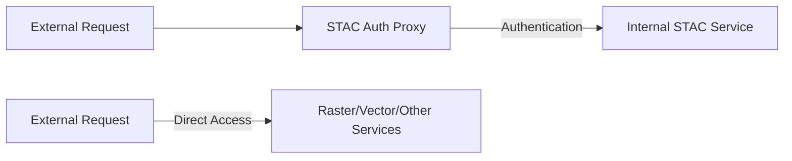
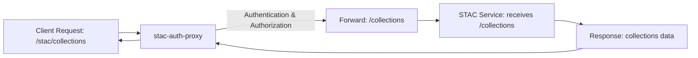

# STAC Auth Proxy Integration with EOAPI-K8S

## Solution Overview

We have implemented support for STAC Auth Proxy integration with EOAPI-K8S through service-specific ingress control. This feature allows the STAC service to be accessible only internally while other services remain externally available.

## Implementation Details

### 1. Service-Specific Ingress Control

Each service can now independently control its ingress settings via the values.yaml configuration:

```yaml
stac:
  enabled: true
  ingress:
    enabled: false  # Disable external ingress for STAC only

# Other services remain externally accessible
raster:
  enabled: true
  ingress:
    enabled: true
```

## Deployment Guide

### 1. Configure EOAPI-K8S

```yaml
# values.yaml for eoapi-k8s
stac:
  enabled: true
  ingress:
    enabled: false  # No external ingress for STAC

# Other services remain externally accessible
raster:
  enabled: true
vector:
  enabled: true
multidim:
  enabled: true
```

### 2. Deploy STAC Auth Proxy

Deploy the stac-auth-proxy Helm chart in the same namespace:

```yaml
# values.yaml for stac-auth-proxy
backend:
  service: stac  # Internal K8s service name
  port: 8080     # Service port

auth:
  # Configure authentication settings
  provider: oauth2
  # ... other auth settings
```

### 3. Network Flow



## Testing

Verify the configuration:

```bash
# Check that STAC paths are excluded
helm template eoapi --set stac.ingress.enabled=false,stac.enabled=true -f values.yaml

# Verify other services remain accessible
kubectl get ingress
kubectl get services
```

Expected behavior:
- STAC service accessible only within the cluster
- Other services (raster, vector, etc.) accessible via their ingress paths
- Auth proxy successfully routing authenticated requests to STAC

## Troubleshooting

1. **STAC Service Not Accessible Internally**
   - Verify service is running: `kubectl get services`
   - Check service port matches auth proxy configuration
   - Verify network policies allow proxy-to-STAC communication

2. **Other Services Affected**
   - Confirm ingress configuration for other services
   - Check ingress controller logs
   - Verify service-specific settings in values.yaml

## Root Path Configuration for Direct Service Access

### Understanding usage of overrideRootPath with stac-auth-proxy

When deploying the EOAPI-K8S with the STAC service behind a stac-auth-proxy, you may want to configure the `stac.overrideRootPath` parameter to control how the FastAPI application handles root path prefixes. This is particularly useful when the auth proxy is responsible for managing the `/stac` path prefix.

When deploying stac-auth-proxy in front of the EOAPI service, you may need to configure the root path behavior to avoid URL conflicts. The `stac.overrideRootPath` parameter allows you to control how the STAC FastAPI application handles root path prefixes.

### Setting overrideRootPath to Empty String

For stac-auth-proxy deployments, you often want to set `stac.overrideRootPath` to an empty string:

```yaml
# values.yaml for eoapi-k8s
stac:
  enabled: true
  overrideRootPath: ""  # Empty string removes --root-path argument
  ingress:
    enabled: false  # Disable external ingress for STAC
```

**Important**: This configuration creates an **intentional inconsistency**:

- **Ingress routes**: Still configured for `/stac` (if ingress was enabled)
- **FastAPI application**: Runs without any root path prefix (no `--root-path` argument)

### Why This Works for stac-auth-proxy

This behavior is specifically designed for stac-auth-proxy scenarios where:

1. **stac-auth-proxy** receives requests via its own ingress and handles the `/stac` path prefix
2. **stac-auth-proxy** filters requests managing the `/stac` prefix and forwards them directly to the STAC service without the path prefix
3. **STAC service** responds from its internal service as if it's running at the root path `/`

### Configuration Examples

#### Standard Deployment (with ingress)

```yaml
stac:
  enabled: true
  # Default behavior - uses ingress.path as root-path
  ingress:
    enabled: true
    path: "/stac"
```

Result: FastAPI runs with `--root-path=/stac`

#### stac-auth-proxy Deployment

```yaml
stac:
  enabled: true
  overrideRootPath: ""  # Empty string - no --root-path argument
  ingress:
    enabled: false  # Access via auth proxy only
```

Result: FastAPI runs without `--root-path` argument

#### Custom Root Path

```yaml
stac:
  enabled: true
  overrideRootPath: "/api/v1/stac"  # Custom path
```

Result: FastAPI runs with `--root-path=/api/v1/stac`

### Request Flow with stac-auth-proxy



## Additional Notes

- The solution leverages Kubernetes service discovery for internal communication
- No changes required to the STAC service itself
- Zero downtime deployment possible
- Existing deployments without auth proxy remain compatible
- The `overrideRootPath: ""` configuration is specifically for proxy scenarios
