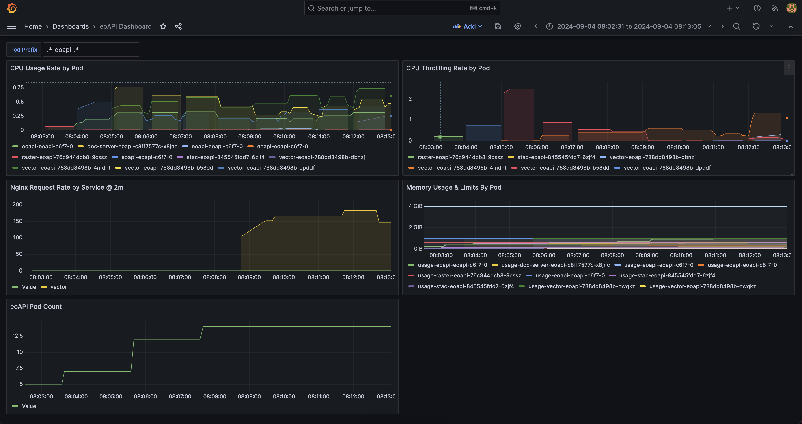

# Autoscaling / Monitoring / Observability

Autoscaling is both art and science. To test out your application's autoscaling requirements you often need to consider
your data volume, data usage patterns, bottlenecks (such as the database) among many, many other things. Load testing, 
metrics, monitoring and observability will help you explore what those needs are. 


> &#9432; The `eoapi-support` chart in this repository (see `../helm-chart/eoapi-support`) is required to be installed to 
enable any of the eoAPI service autoscaling. It cannot be listed as a dependecy of `eoapi` chart 
b/c of the limitations in `prometheus-adapter` and `grafana` for constructing the Prometheus internal 
service domains dynamically.

If you are comfortable with k8s you probably only need to `helm install` the support chart and be on your way. Other folks
might want to read through the verbose walkthrough material below to familiarize yourself with how things work.

---

## Helm Install `eoapi-support`

The following instructions assume you've gone through the [AWS](./docs/aws-eks.md) or [GCP](./docs/gcp-gke.md) cluster set up
and installed the `eoapi` chart.


1. Go to the [releases section](https://github.com/developmentseed/eoapi-k8s/releases) of this repository and find the latest 
`eoapi-support-<version>` version to install. The example below assumes we're working with `eoapi-support-0.1.4`


2. Decide on a release name and `namespace` for your support chart. The next steps assume we've 
chosen a release name of `eoapi-support` and a similar namespace of `eoapi-support`


3. Then do a normal `helm install` but you'll want to parameterize and pass overrides for the prometheus URL to include
the release name and namespace chosen above. This allows other third-party dependencies used in the chart 
(`prometheus-adpater` and `grafana`) know where to find the prometheus service internally. This is unfortunately a 
manual step that cannot be automated

   ```bash
   helm upgrade --install -n eoapi-support \
     --create-namespace eoapi-support eoapi/eoapi-support --version 0.1.4 \
     --set prometheus-adapter.prometheus.url='http://eoapi-support-prometheus-server.eoapi-support.svc.cluster.local' \
     --set grafana.datasources.datasources\\.yaml.datasources[0].url='http://eoapi-support-prometheus-server.eoapi-support.svc.cluster.local'
   ```


4. verify that everything is set up correctly and no deployments are not failing:

   ```sh
   watch -n 1 "kubectl -n eoapi-support get deploy,pod,svc"
   NAME                                                    READY   STATUS    RESTARTS   AGE
   pod/eoapi-support-grafana-7fdc9688dd-wkw7p              1/1     Running   0          79s
   pod/eoapi-support-kube-state-metrics-54d75784db-ghgbd   1/1     Running   0          79s
   pod/eoapi-support-prometheus-adapter-668b6bd89c-kb25q   1/1     Running   0          79s
   pod/eoapi-support-prometheus-node-exporter-6f96z        1/1     Running   0          79s
   pod/eoapi-support-prometheus-node-exporter-fr96x        1/1     Running   0          79s
   pod/eoapi-support-prometheus-node-exporter-pdvvp        1/1     Running   0          79s
   pod/eoapi-support-prometheus-server-76dcfc684b-wmk5c    2/2     Running   0          79s

   NAME                                             TYPE           CLUSTER-IP       EXTERNAL-IP      PORT(S)        AGE
   service/eoapi-support-grafana                    LoadBalancer   10.123.248.75    104.154.59.180   80:30821/TCP   79s
   service/eoapi-support-kube-state-metrics         ClusterIP      10.123.241.247   <none>           8080/TCP       79s
   service/eoapi-support-prometheus-adapter         ClusterIP      10.123.249.21    <none>           443/TCP        79s
   service/eoapi-support-prometheus-node-exporter   ClusterIP      10.123.249.90    <none>           9100/TCP       79s
   service/eoapi-support-prometheus-server          ClusterIP      10.123.247.255   <none>           80/TCP         79s 
   ```
   

5. If anything in steps 1 through 3 seems confusing then here is a quick bash script to clear it up:

   ```shell
   export RELEASE_NAME=eoapi
   export RELEASE_NS=eoapi
   export SUPPORT_RELEASE_NAME=eoapi-support
   export SUPPORT_RELEASE_NS=eoapi-support
   PROMETHEUS_URL="http://${SUPPORT_RELEASE_NAME}-prometheus-server.${SUPPORT_RELEASE_NS}.svc.cluster.local"

   helm upgrade --install \
     -n $SUPPORT_RELEASE_NS --create-namespace $SUPPORT_RELEASE_NAME \
     eoapi/eoapi-support --version 0.1.4 \
     --set prometheus-adapter.prometheus.url=$PROMETHEUS_URL \
     --set grafana.datasources.datasources\\.yaml.datasources[0].url=$PROMETHEUS_URL \
     -f /tmp/values-overrides.yaml

   helm upgrade --install \
     -n $RELEASE_NS --create-namespace $RELEASE_NAME \
     eoapi/eoapi --version 0.4.6 \
     -f /tmp/support-values-overrides.yaml
   ```


---

### Review [Default Configuration and Options](configuration.md)

[This document](configuration.md) will explain the differences in the `autoscaling` block for each service:

   ```yaml
   autoscaling:
       enabled: false
       minReplicas: 1
       maxReplicas: 10
       # `type`: "cpu" || "requestRate" || "both"
       type: "requestRate"
       behaviour: {}
         scaleDown:
           stabilizationWindowSeconds: 60
         scaleUp:
           stabilizationWindowSeconds: 0
       targets:
         # matches `type` value above unless `type: "both"` is selected
         cpu: 85
         requestRate: 15000
   ```

---

### How Autoscaling Works

If you grok the default `eoapi-support` values in `values.yaml` you'll see we use custom metrics and prometheus queries
based on the nginx ingress controller's request rate under the `prometheus-adpater.prometheus:` key:

   ```yaml
   prometheus-adapter:
     prometheus:
       # NOTE: the `url` below make some assumptions about the namespace where you released eoapi and prometheus
       # 1) that you didn't change the default name of the `prometheus-server` or the port and installed in eoapi namespace
       # 2) namely that you ran `helm install eoapi --create-namespace=eoapi`  with the `eoapi` namespace
       url: http://eoapi-support-prometheus-server.eoapi.svc.cluster.local
       port: 80
       path: ""
     rules:
       default: false
       # NOTE: the `name.as` values below make some assumptions about your release name
       # namely that you have run `helm install eoapi eoapi/eoapi --create-namespace=eoapi`
       custom:
       - seriesQuery: '{__name__=~"^nginx_ingress_controller_requests$",namespace!=""}'
         seriesFilters: []
         resources:
           template: <<.Resource>>
         name:
           matches: ""
           as: "nginx_ingress_controller_requests_rate_vector_eoapi"
         metricsQuery: round(sum(rate(<<.Series>>{service="vector",path=~"/vector.*",<<.LabelMatchers>>}[5m])) by (<<.GroupBy>>), 0.001)
       - seriesQuery: '{__name__=~"^nginx_ingress_controller_requests$",namespace!=""}'
         seriesFilters: []
         resources:
           template: <<.Resource>>
         name:
           matches: ""
           as: "nginx_ingress_controller_requests_rate_raster_eoapi"
         metricsQuery: round(sum(rate(<<.Series>>{service="raster",path=~"/raster.*",<<.LabelMatchers>>}[5m])) by (<<.GroupBy>>), 0.001)
       - seriesQuery: '{__name__=~"^nginx_ingress_controller_requests$",namespace!=""}'
         seriesFilters: []
         resources:
           template: <<.Resource>>
         name:
           matches: ""
           as: "nginx_ingress_controller_requests_rate_stac_eoapi"
         metricsQuery: round(sum(rate(<<.Series>>{service="stac",path=~"/stac.*",<<.LabelMatchers>>}[5m])) by (<<.GroupBy>>), 0.001)
   ```

Prometheus adapter is a bridge for metrics between Prometheus (which scrapes nginx) and the k8s metrics server so it can autoscale deployments using these custom metrics. 
If you've chosen `both` or `requestRate` as a autoscaling `type:` for those values then these custom metrics are used to template an `hpa.yaml` for each service

### Log into Grafana

When you `helm install` the support chart you by default get a Grafana dashboard set up with different default metrics charts
to help you load test and explore your service autoscaling. Grafana creates a new username `admin` and password for you 
that you'll have to retrieve to login.

> &#9432; Note that the `service/eoapi-support-grafana` has an EXTERNAL-IP that we can use to view it. 
This is just a quick way to work with it. You'll want to set it up with an ingress in the future


1. To log into Grafana you'll need to export the default username/password it came installed with. Note that secret names are prefixed
with the `release` name we installed the chart with below `<release-name>-grafana`:

   ```sh
   kubectl get secret eoapi-support-grafana --template='{{index .data "admin-user"}}' -n eoapi | base64 -d
     # <not-showing-output>
   kubectl get secret eoapi-support-grafana --template='{{index .data "admin-password"}}' -n eoapi | base64 -d
     # <not-showing-output>
   ```
   
2. To find the URL for the load balancer for where to log in with Grafana you can query the services:

   ```sh
   kubectl get svc -n eoapi-support
   ```
   
3. Login and you should be default be able to see the eoapi-k8s grafana dashboard

   
   
### Install or Upgrade Autoscaling Changes to `eoapi` Chart

1. If you haven't already decide which services (`vector` || `raster` || `stac`) you want to enable `autoscaling` on change your values yaml for these and redeploy

   ```yaml
   stac:
     enabled: true
     autoscaling:
       enabled: true
       type: "requestRate"
       targets:
         requestRate: 50000m
     settings:
       resources:
         limits:
           cpu: "1280m"
           memory: "1536Mi"
         requests:
           cpu: "512m"
           memory: "1024Mi"
   vector:
     enabled: true
     autoscaling:
       enabled: true
       type: "requestRate"
       targets:
         requestRate: 50000m
     settings:
       resources:
         limits:
           cpu: "768m"
           memory: "1536Mi"
         requests:
           cpu: "256m"
           memory: "1024Mi"
   ```
   
2. Review what the heck the unit `m` means for your [autoscaling values in the k8s docs](https://kubernetes.io/docs/tasks/run-application/horizontal-pod-autoscale-walkthrough/#quantities)


3. Then `helm install` the eoapi chart with these changes

   ```sh
   helm upgrade --install -n eoapi...
   ```

---

### Add Load Balancer Host as a Host to Your Ingress

Unfortunately, nginx will not expose metrics for ingresses without hosts or hosts with wildcards. You'll either need to deploy
`eoapi-k8s` chart again with `ingress.tls.enabled` or need to find the `EXTERNAL-IP` for your `ingress-nginx-controller` and use that
to set up a simple host

1. Find the IP that your `ingress-nginx-controller` service load balancer:

   ```sh
   kubectl -n ingress-nginx  get svc/ingress-nginx-controller -o=jsonpath='{.status.loadBalancer.ingress[0].hostname}'
     http://abc5929f88f8c45c38f6cbab2faad43c-776419634.us-west-2.elb.amazonaws.com/
   ```

2. Then live edit your shared ingress for eoapi services to add the host:

   ```sh
   kubectl edit ingress nginx-service-ingress-shared-eoapi -n eoapi
   ```
   
   ```yaml
   # BEFORE
   spec:
   ingressClassName: nginx
   rules:
   - http:
       paths:
       ...
   ```

   ```yaml
   # AFTER
   spec:
   ingressClassName: nginx
   rules:
   - host: abc5929f88f8c45c38f6cbab2faad43c-776419634.us-west-2.elb.amazonaws.com
     http:
       paths:
       ...
   ```

And then finally roll out the deployment.

   ```sh
   kubectl rollout restart deploy/ingress-nginx-controller -n ingress-nginx

   ```

---

### Now move onto the [Load Testing](loadtesting.md) document