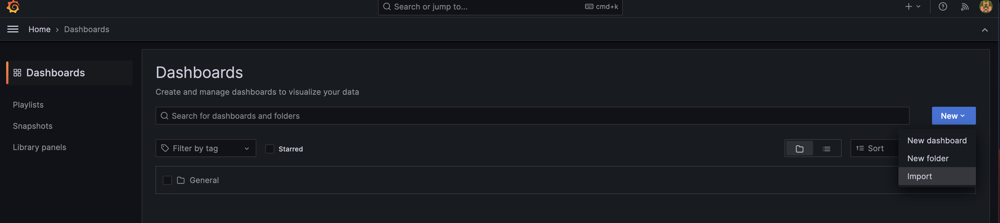
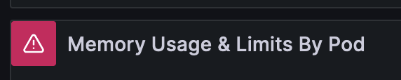
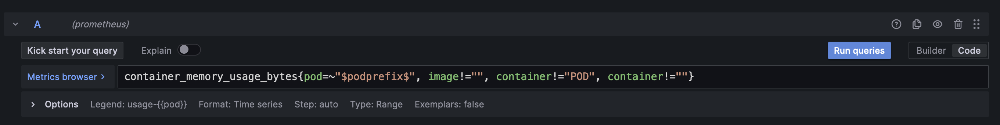

## Autoscaling

Autoscaling is both art and science. To test our your application's autoscaling needs you often need to consider
your data volume, data usage patterns, bottlenecks (such as the database) among many, many other things.

Load testing, metrics and observability will help you explore what those autoscaling needs are. The `eoapi` chart
includes some default autoscaling values as well as an `eoapi-support` chart to help you do this exploration. Below
we walk through how these things work and are set up.

---

### Verify `metrics-server` is installed by default in EKS or GCP

Newer versions of AWS EKS and GCP GKE "should" come with `metrics-server` (the default k8s metrics utility) pre-installed
in the `kube-system` namespace. You can verify this using:

```bash
$ kubectl get deployment metrics-server -n kube-system
```

If it's not there then you can install it with default configuration by doing:

```bash
$ helm repo add bitnami https://charts.bitnami.com/bitnami
$ helm repo update
$ helm -n default install metrics-server bitnami/metrics-server
```

---

### Review [Default Configuration and Options](./configuration.md)

This document will explain the differences in the `autoscaling` block for each service:

```yaml
autoscaling:
    enabled: false
    minReplicas: 1
    maxReplicas: 10
    # `type`: "cpu" || "requestRate" || "both"
    type: "requestRate"
    behaviour: {}
#      scaleDown:
#        stabilizationWindowSeconds: 60
#      scaleUp:
#        stabilizationWindowSeconds: 0
    targets:
      # matches `type` value above unless `type: "both"` is selected
      cpu: 85
      requestRate: 15000
```

---

### Review [Production Storage](./aws-gpc-storage-walkthrough.md) Set Up

The default `eoapi` helm chart installs an in-memory postgres/postgis database but mostly folks will want to
test autoscaling against something more production suitable

---

### Install `eoapi-supprt` Chart

This chart has the metrics, observability and visualization dependencies

1. change into this repositories `/helm-chart/` folder

2. then download the dependencies for the `eoapi-support` chart

    ```bash
    $ helm dependency build ./eoapi-support
    ```

3. then install those dependencies:

    ```bash
    $ helm install \
      --namespace eoapi \
      --create-namespace \
      eoapi-support \
      ./eoapi-support
    ```
   
4. verify that everything is set up correctly and no deployments are failing:

    ```bash
    $ watch -n 1 "kubectl get pod,svc"
  
    NAME                                                    READY   STATUS    RESTARTS   AGE
    pod/eoapi-support-grafana-7fdc9688dd-wkw7p              1/1     Running   0          79s
    pod/eoapi-support-kube-state-metrics-54d75784db-ghgbd   1/1     Running   0          79s
    pod/eoapi-support-prometheus-adapter-668b6bd89c-kb25q   1/1     Running   0          79s
    pod/eoapi-support-prometheus-node-exporter-6f96z        1/1     Running   0          79s
    pod/eoapi-support-prometheus-node-exporter-fr96x        1/1     Running   0          79s
    pod/eoapi-support-prometheus-node-exporter-pdvvp        1/1     Running   0          79s
    pod/eoapi-support-prometheus-server-76dcfc684b-wmk5c    2/2     Running   0          79s

    NAME                                             TYPE           CLUSTER-IP       EXTERNAL-IP      PORT(S)        AGE
    service/eoapi-support-grafana                    LoadBalancer   10.123.248.75    104.154.59.180   80:30821/TCP   79s
    service/eoapi-support-kube-state-metrics         ClusterIP      10.123.241.247   <none>           8080/TCP       79s
    service/eoapi-support-prometheus-adapter         ClusterIP      10.123.249.21    <none>           443/TCP        79s
    service/eoapi-support-prometheus-node-exporter   ClusterIP      10.123.249.90    <none>           9100/TCP       79s
    service/eoapi-support-prometheus-server          ClusterIP      10.123.247.255   <none>           80/TCP         79s 
    ```

5. 

6. note that the `service/eoapi-support-grafana` has an EXTERNAL-IP that we can use to view it. This is just a quick way to work with it. You'll want to set it up with a ingress in the future

7. to log into Grafana you'll need to export the default username/password it came installed with:

   ```bash
   $ kubectl get secret eoapi-support-grafana --template='{{index .data "admin-user"}}' | base64 -d
   <not-showing-output>
   $ kubectl get secret eoapi-support-grafana --template='{{index .data "admin-password"}}' | base64 -d
   <not-showing-output>
   ```

8. In your browser navigate to the `service/eoapi-support-grafana` EXTERNAL-IP, log in using credentials from the last step and manually upload the Grafana `eoAPI Dashboard` included in `/helm-chart/eoapi-support/eoAPI-Dashboard.json`




8. Unfortunately most of the data sources will show an error about not being found (as seen below)




9. For each chart click on the kebob in the top right-hand corner and choose `Edit`


10. Then in the query input box just add an empty space at the end of the query and click `Run queries` again




11. Your chart WILL NOT show data yet b/c we don't have the `eoapi` services installed yet
---

### Install Newest `eoapi` Chart

1. In your terminal:

   ```bash
   $ helm repo add eoapi https://devseed.com/eoapi-k8s/
   $ helm repo update
   ```

2. Add the required secret overrides and changes you need to an arbitrarily named `.yaml` file (`config.yaml` below) 
but the important part here is that we are enabling `autoscaling` and playing with `requestRate` metric

   ```bash
   $ cat config.yaml 
   ```
   
   ```yaml
   ingress:
     enabled: true
     className: "nginx"
   db:
     enabled: true
     settings:
       resources:
         requests:
           storage: "100Mi"
           cpu: "256m"
           memory: "1024Mi"
         limits:
           cpu: "512m"
           memory: "1024Mi"
       secrets:
         PGUSER: "username"
         POSTGRES_USER: "username"
         PGPASSWORD: "password"
         POSTGRES_PASSWORD: "password"
   raster:
     enabled: true
     autoscaling:
       enabled: true
       type: "requestRate"
       targets:
         requestRate: 50
     settings:
       resources:
         limits:
           cpu: "768m"
           memory: "4096Mi"
         requests:
           cpu: "256m"
           memory: "1024Mi"
   stac:
     enabled: true
     autoscaling:
       enabled: true
       type: "requestRate"
       targets:
         requestRate: 50
     settings:
       resources:
         limits:
           cpu: "1280m"
           memory: "1536Mi"
         requests:
           cpu: "512m"
           memory: "1024Mi"
   vector:
     enabled: true
     autoscaling:
       enabled: true
       type: "requestRate"
       targets:
         requestRate: 50
     settings:
       resources:
         limits:
           cpu: "768m"
           memory: "1536Mi"
         requests:
           cpu: "256m"
           memory: "1024Mi"
   ```

3. Then `helm install` the eoapi chart pointing to the path for the `config.yaml` above

   ```bash
   $ helm install -n eoapi --create-namespace eoapi eoapi/eoapi -f config.yaml
   ```

4. Make sure all pods and services are in `STATUS=Running`:

   ```bash
   NAME                                                    READY   STATUS              RESTARTS      AGE
   pod/doc-server-6dd9c9c888-8l8tv                         1/1     Running             0             87s
   pod/eoapi-support-grafana-865b7f49f5-6qkmj              1/1     Running             0             46m
   pod/eoapi-support-kube-state-metrics-54d75784db-d899f   1/1     Running             0             46m
   pod/eoapi-support-prometheus-adapter-6bd87848fd-glc46   1/1     Running             0             46m
   pod/eoapi-support-prometheus-node-exporter-d7vks        0/1     ContainerCreating   0             5s
   pod/eoapi-support-prometheus-node-exporter-np54q        1/1     Running             0             46m
   pod/eoapi-support-prometheus-node-exporter-rsgc5        1/1     Running             0             46m
   pod/eoapi-support-prometheus-node-exporter-tcqvb        1/1     Running             0             46m
   pod/eoapi-support-prometheus-server-76dcfc684b-f78k8    2/2     Running             0             46m
   pod/pgstac-6648b8cc89-v55fh                             0/2     Pending             0             87s
   pod/raster-eoapi-b859dd849-7fvwn                        0/1     ContainerCreating   0             87s
   pod/stac-eoapi-8c865f5cd-pjhx6                          1/1     Running             1 (26s ago)   87s
   pod/vector-eoapi-9957c7469-qk8hn                        1/1     Running             1 (26s ago)   87s

   NAME                                             TYPE           CLUSTER-IP       EXTERNAL-IP    PORT(S)        AGE
   service/doc-server                               ClusterIP      10.123.252.119   <none>         80/TCP         87s
   service/eoapi-support-grafana                    LoadBalancer   10.123.250.188   34.171.130.0   80:31513/TCP   46m
   service/eoapi-support-kube-state-metrics         ClusterIP      10.123.251.118   <none>         8080/TCP       46m
   service/eoapi-support-prometheus-adapter         ClusterIP      10.123.243.36    <none>         443/TCP        46m
   service/eoapi-support-prometheus-node-exporter   ClusterIP      10.123.247.202   <none>         9100/TCP       46m
   service/eoapi-support-prometheus-server          ClusterIP      10.123.249.238   <none>         80/TCP         46m
   service/pgstac                                   ClusterIP      10.123.244.121   <none>         5432/TCP       87s
   service/raster                                   ClusterIP      10.123.253.229   <none>         8080/TCP       87s
   service/stac                                     ClusterIP      10.123.245.192   <none>         8080/TCP       87s
   service/vector                                   ClusterIP      10.123.247.62    <none>         8080/TCP       87s
   ```

5. Now we need to tell the nginx ingress controller that it should allow prometheus to scrape it. This is a requirement to get our custom metrics. 

6. Get the values that `ingress-nginx` was deployed with so we can append our rules to them. Oftentimes this resource is in `ingress-nginx` namespace

   ```bash
   # this assumes your release name is `ingress-nginx`, though you might've named it something else
   $ helm get values ingress-nginx -n ingress-nginx
   
   USER-SUPPLIED VALUES:
   controller:
     replicaCount: 1
     service:
       externalTrafficPolicy: Local
       loadBalancerIP: 12.234.567.89
   ```

7. Create an empty `config.yaml` somewhere on your file system. Take everything from below `USER-SUPPLIED VALUES:` and make ingress-inginx scrapable

   ```yaml
   controller:
     service:
       externalTrafficPolicy: Local
       loadBalancerIP: 12.234.567.89
     # requires `prometheus.create = true`
     enableLatencyMetrics: true
     metrics:
       enabled: true
       service:
         annotations:
           prometheus.io/scrape: "true"
           prometheus.io/port: "10254"
   ```
   
8. Redeploy your `ingress-nginx` release with the configuration from the last step:

   ```bash
   # this assumes your release name is `ingress-nginx` and that the repo was installed as `ingress-nginx` 
   # though you might've named them something else
   $ helm -n ingress-nginx upgrade ingress-nginx ingress-nginx/ingress-nginx -f config.yaml
   ```

10. Now go back to Grafana and hit the refresh button and wait a bit. You should see data in your graphs

### Now move onto the [Load Testing](./configuration.md) document