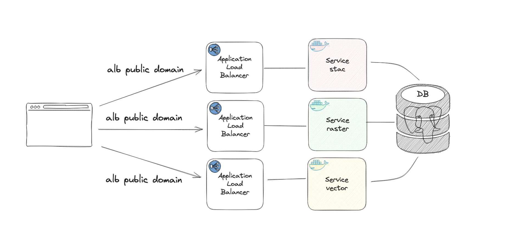

# Configuration Options

## Required Values

The required values to pass to `helm install` or `helm template` commands can be found by showing what is validated:

```bash
$ head -n 9 <eoapi-k8s-repo>/values.schema.json
{
  "$schema": "http://json-schema.org/schema#",
  "type": "object",
  "required": [
    "db",
    "service",
    "gitSha"
  ],
```

Most of the required fields have common-sense defaults except traditional username and password secrets under `db`. 
The table below and the `values.yaml` comments should explain what the options and defaults are:

|                               **Values Key**                              |                                                              **Description**                                                              |  **Default** | **Choices**            |
|:-------------------------------------------------------------------------|:-----------------------------------------------------------------------------------------------------------------------------------------|:------------|:------------------------|
| `db.settings.secrets.PGUSER`<br>`db.settings.secrets.PGPASSWORD`              | username and password used by application for connections<br>https://www.postgresql.org/docs/current/libpq-envars.html                    |              |                        |
| `db.settings.secrets.POSTGRES_USER`<br>`db.settings.secrets.POSTGRES_PASSWORD` | username and password used by<br>base postgresl image for admin purposes<br>see https://www.postgresql.org/docs/current/libpq-envars.html |              |                        |
| `service.port`                                                              | the port that all vector/raster/stac services run on<br>used in `kind: Service` and `kind: Ingress`                                       |     8080     |   your favorite port   |
| `gitSha`                                                                    | sha attached to a `kind: Deployment` key `metadata.labels`                                                                                | gitshaABC123 | your favorite sha      |


--- 

## Default Configuration

Running `helm install` from https://devseed.com/eoapi-k8s/ with this simple `config.yml` overrides below
should spin up similar infrastructure in EKS or GKE:

```python
$ cat config.yaml 
db:
  settings:
    secrets:
      PGUSER: "username"
      POSTGRES_USER: "username"
      PGPASSWORD: "password"
      POSTGRES_PASSWORD: "password"
```

In EKS or GKE you'll by default get:

* a pgstac PostgreSQL database deployment and service
* the same vector and raster data fixtures used for testing loaded into the DB
* a load balancer and nginx-compatible ingress with the following path rewrites:
    * a `/stac` service for `stac_fastapi.pgstac`
    * a `/raster` service for `titler.pgstac`
    * a `/vector` service for `tipg.pgstac`

Here's a simplified high-level diagram to grok:


---

## Additional Options

### Key `ingress.className`

|   **Values Key**  |                                                                 **Description**                                                                 | **Default** | **Choices**  |
|:-----------------|:-----------------------------------------------------------------------------------------------------------------------------------------------|:-----------|:--------------|
| `ingress.className` | used as switch in helm templates for specific<br>functionality regarding `kind: Ingress` and cloud-provider<br>specific load balancing options  | nginx       | nginx<br>alb<br>gce<br> |

#### Given `ingress.className=nginx`


#### Given `ingress.className=alb||gce` 


---

### Key `autoscaling`

#### `autoscaling.type`

|   **Values Key**  |                                                                 **Description**                                                                 | **Default** | **Choices**  |
|:-----------------|:-----------------------------------------------------------------------------------------------------------------------------------------------|:-----------|:--------------|
| `autoscaling.type` | a simple example of a default metric (`cpu`) and custom metric (`requestRate`) to scale by. NOTE: `requestRate` is based on nginx metrics and currently isn't supported for `ingress.className: alb/gce` options yet. It will throw an error during install if you attemp this. If selecting `both` the metric that results in the "highest amount of change" wins. See https://kubernetes.io/docs/tasks/run-application/horizontal-pod-autoscale/#scaling-on-multiple-metrics for more info  | requestRate       | requestRate<br>cpu<br>both<br> |

#### `autoscaling.behaviour.[scaleDown||scaleUp]`

These are normal k8s autoscaling pass throughs. They are stablization windows in seconds to for scaling up or down to prevent flapping from happening. Read more about [the options on the k8s documentation](https://kubernetes.io/docs/tasks/run-application/horizontal-pod-autoscale/#configurable-scaling-behavior)