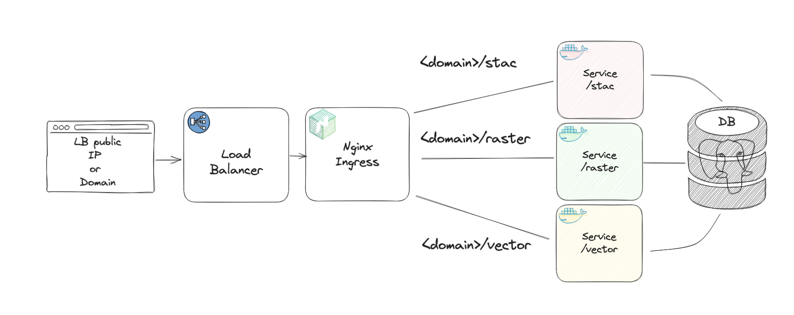

# Configuration Options

## Required Values

The required values to pass to `helm install` or `helm template` commands can be found in our schema validation:

```bash
{
  "required": [
    "service",
    "gitSha"
  ]
}
```

Most fields have sensible defaults. Here are the core configuration options:

| **Values Key** | **Description** | **Default** | **Choices** |
|:--------------|:----------------|:------------|:------------|
| `service.port` | Port for all services (vector/raster/stac) | 8080 | any valid port |
| `gitSha` | SHA for deployment tracking | gitshaABC123 | any valid SHA |
| `previousVersion` | Previous version during upgrades | "" | semantic version |

## Database Configuration

### PostgreSQL Cluster (Default)

Using Crunchydata's PostgreSQL Operator (`postgresql.type: "postgrescluster"`):

| **Values Key** | **Description** | **Default** | **Choices** |
|:--------------|:----------------|:------------|:------------|
| `postgrescluster.enabled` | Enable PostgreSQL cluster | true | true/false |
| `postgrescluster.name` | Cluster name | Release name | any valid k8s name |
| `postgrescluster.postgresVersion` | PostgreSQL version | 16 | supported versions |
| `postgrescluster.postGISVersion` | PostGIS version | "3.4" | supported versions |

### External Database

For external databases, set `postgresql.type` to either:

1. Using plaintext credentials (`external-plaintext`):
```yaml
postgresql:
  type: "external-plaintext"
  external:
    host: "your-host"
    port: "5432"
    database: "eoapi"
    credentials:
      username: "eoapi"
      password: "your-password"
```

2. Using Kubernetes secrets (`external-secret`):
```yaml
postgresql:
  type: "external-secret"
  external:
    existingSecret:
      name: "your-secret"
      keys:
        username: "username"
        password: "password"
    host: "your-host"  # can also be in secret
    port: "5432"       # can also be in secret
    database: "eoapi"  # can also be in secret
```

## Ingress Configuration

Unified ingress configuration supporting both NGINX and Traefik:

| **Values Key** | **Description** | **Default** | **Choices** |
|:--------------|:----------------|:------------|:------------|
| `ingress.enabled` | Enable ingress | true | true/false |
| `ingress.className` | Ingress controller | "nginx" | "nginx", "traefik" |
| `ingress.host` | Ingress hostname | "" | valid hostname |
| `ingress.rootPath` | Doc server root path | "" | valid path |

See [Unified Ingress Configuration](unified-ingress.md) for detailed setup.

## Service Configuration

Each service (stac, raster, vector, multidim) supports:

| **Values Key** | **Description** | **Default** | **Choices** |
|:--------------|:----------------|:------------|:------------|
| `{service}.enabled` | Enable the service | varies | true/false |
| `{service}.image.name` | Container image | varies | valid image |
| `{service}.image.tag` | Image tag | varies | valid tag |
| `{service}.autoscaling.enabled` | Enable HPA | false | true/false |
| `{service}.autoscaling.type` | Scaling metric | "requestRate" | "cpu", "requestRate", "both" |

Example service configuration:
```yaml
raster:
  enabled: true
  autoscaling:
    enabled: true
    minReplicas: 2
    maxReplicas: 10
    type: "requestRate"
    targets:
      cpu: 75
      requestRate: "100000m"
```

## STAC Browser

| **Values Key** | **Description** | **Default** | **Choices** |
|:--------------|:----------------|:------------|:------------|
| `browser.enabled` | Enable STAC browser | true | true/false |
| `browser.replicaCount` | Number of replicas | 1 | integer > 0 |
| `browser.ingress.enabled` | Enable browser ingress | true | true/false |

## Deployment Architecture

When using default settings, the deployment looks like this:


The deployment includes:
- HA PostgreSQL database (via PostgreSQL Operator)
- Sample data fixtures
- Load balancer with path-based routing:
  - `/stac` → STAC API
  - `/raster` → Titiler
  - `/vector` → TiPG
  - `/browser` → STAC Browser
  - `/` → Documentation

### Health Monitoring

All services include health check endpoints with automatic liveness probes:

| **Service** | **Health Endpoint** | **Response** |
|:------------|:-------------------|:-------------|
| STAC API | `/stac/_mgmt/ping` | HTTP 200, no auth required |
| Raster API | `/raster/healthz` | HTTP 200, no auth required |
| Vector API | `/vector/healthz` | HTTP 200, no auth required |

The Kubernetes deployment templates automatically configure `livenessProbe` settings for regular health checks. See the [deployment template](../../charts/eoapi/templates/services/deployment.yaml) for probe configuration details.

## Advanced Configuration

### Autoscaling Behavior

Fine-tune scaling behavior:

```yaml
autoscaling:
  behaviour:
    scaleDown:
      stabilizationWindowSeconds: 60
    scaleUp:
      stabilizationWindowSeconds: 0
```

See [Kubernetes HPA documentation](https://kubernetes.io/docs/tasks/run-application/horizontal-pod-autoscale/#configurable-scaling-behavior) for details.

### Resource Requirements

Each service can have custom resource limits:

```yaml
settings:
  resources:
    limits:
      cpu: "768m"
      memory: "1024Mi"
    requests:
      cpu: "256m"
      memory: "512Mi"
```

### Additional Service Settings

Each service also supports:
```yaml
settings:
  labels: {}                # Additional pod labels
  extraEnvFrom: []         # Additional environment variables from references
  extraVolumeMounts: []    # Additional volume mounts
  extraVolumes: []         # Additional volumes
  envVars: {}             # Environment variables
```
