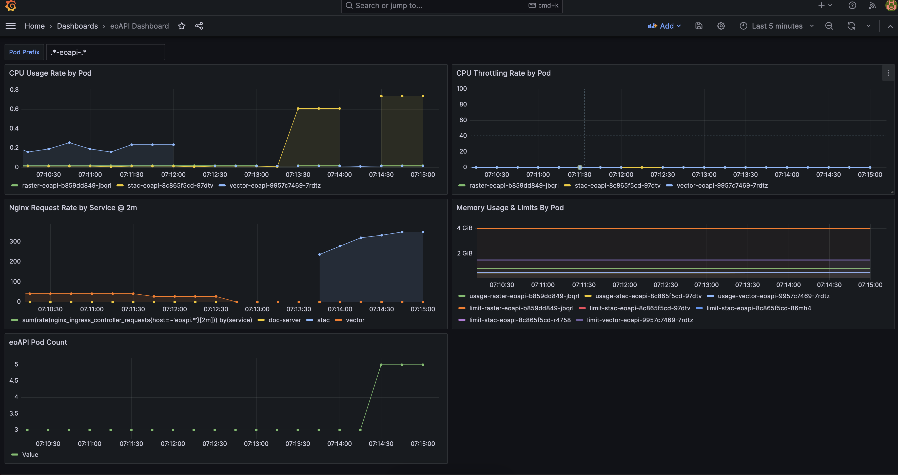

## Load Testing

#### Naive Load Testing using `hey`

Everything mentioned below assumes you've already gone through the [Autoscaling Doc](autoscaling.md) and
that you're deploying using `ingress.className: "nginx"`.

0. Install `hey` utility locally

1. Find the external IP of your shared nginx ingress

    ```bash
    $ kubectl -n eoapi get ingress/nginx-service-ingress-shared-eoapi -o=jsonpath='{.spec.rules[0].host}'
    eoapi-35.234.254.12.nip.io%    
    ```

2. Then run some naive load testing against some static read-only endpoints in a couple different terminals or backgrounded

    ```bash
    hey -n 2000000 -q 150 -c 20 http://eoapi-35.234.254.12.nip.io/vector/collections/public.my_data/items?f=geojson
    hey -n 2000000 -q 150 -c 20 http://eoapi-35.234.254.12.nip.io/stac/
    ```
   
3. Go to Grafana again and watch your services autoscaling for services you are actually hitting

