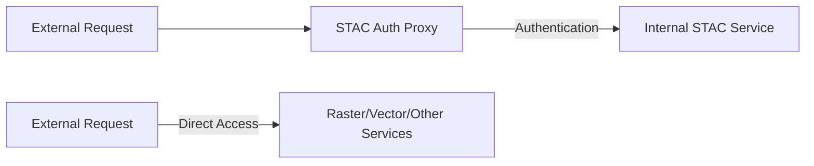

# STAC Auth Proxy Integration with EOAPI-K8S

## Solution Overview

We have implemented support for STAC Auth Proxy integration with EOAPI-K8S through service-specific ingress control. This feature allows the STAC service to be accessible only internally while other services remain externally available.

## Implementation Details

### 1. Service-Specific Ingress Control

Each service can now independently control its ingress settings via the values.yaml configuration:

```yaml
stac:
  enabled: true
  ingress:
    enabled: false  # Disable external ingress for STAC only

# Other services remain externally accessible
raster:
  enabled: true
  ingress:
    enabled: true
```

### 2. Template Changes

The ingress template now checks service-specific settings:

```yaml
{{- if and .Values.stac.enabled (or (not (hasKey .Values.stac "ingress")) .Values.stac.ingress.enabled) }}
- pathType: {{ .Values.ingress.pathType }}
  path: /stac{{ .Values.ingress.pathSuffix }}
  backend:
    service:
      name: stac
      port:
        number: {{ .Values.service.port }}
{{- end }}
```

This ensures:
- Service paths are only included if the service and its ingress are enabled
- Backward compatibility is maintained (ingress enabled by default)
- Clean separation of service configurations

## Deployment Guide

### 1. Configure EOAPI-K8S

```yaml
# values.yaml for eoapi-k8s
stac:
  enabled: true
  ingress:
    enabled: false  # No external ingress for STAC

# Other services remain externally accessible
raster:
  enabled: true
vector:
  enabled: true
multidim:
  enabled: true
```

### 2. Deploy STAC Auth Proxy

Deploy the stac-auth-proxy Helm chart in the same namespace:

```yaml
# values.yaml for stac-auth-proxy
backend:
  service: stac  # Internal K8s service name
  port: 8080     # Service port

auth:
  # Configure authentication settings
  provider: oauth2
  # ... other auth settings
```

### 3. Network Flow



## Testing

Verify the configuration:

```bash
# Check that STAC paths are excluded
helm template eoapi --set stac.ingress.enabled=false,stac.enabled=true -f values.yaml

# Verify other services remain accessible
kubectl get ingress
kubectl get services
```

Expected behavior:
- STAC service accessible only within the cluster
- Other services (raster, vector, etc.) accessible via their ingress paths
- Auth proxy successfully routing authenticated requests to STAC

## Troubleshooting

1. **STAC Service Not Accessible Internally**
   - Verify service is running: `kubectl get services`
   - Check service port matches auth proxy configuration
   - Verify network policies allow proxy-to-STAC communication

2. **Other Services Affected**
   - Confirm ingress configuration for other services
   - Check ingress controller logs
   - Verify service-specific settings in values.yaml

## Additional Notes

- The solution leverages Kubernetes service discovery for internal communication
- No changes required to the STAC service itself
- Zero downtime deployment possible
- Existing deployments without auth proxy remain compatible
